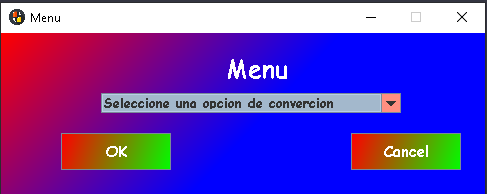
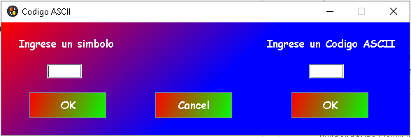
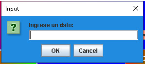
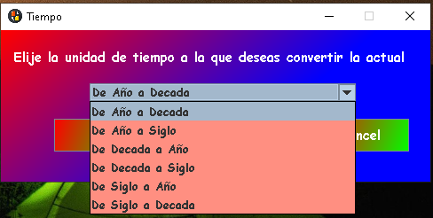
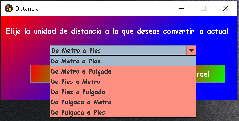
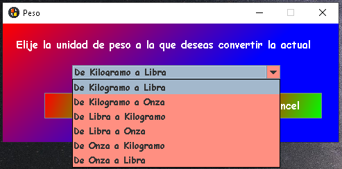
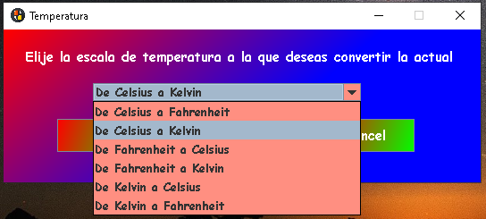
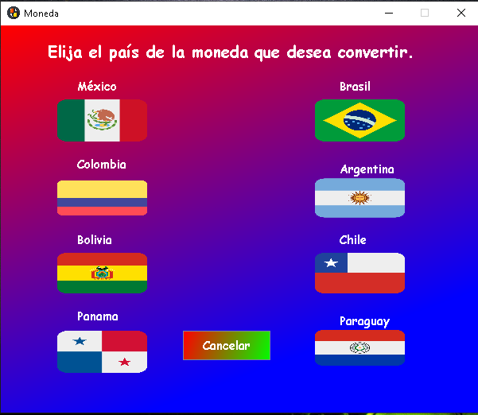
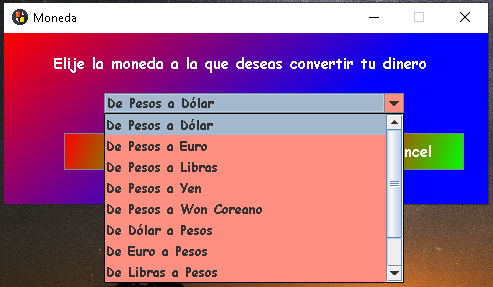

# ConversorMonedas

<h1 align="center"> Conversor de Monedas </h1>
<h3>Introducción</h3>

Este proyecto tiene como proposito proporcionar al usuario un conversor de moneda de su pais a otras divisas extrangeras,
al igual que incluye varias funciones extra que el usuario podría necesitar algún día.

Las funciones de este proyecto son las siguientes:
<ol>
  <li>Conversor de Moneda</li>
  <li>Conversor de Temperatura</li>
  <li>Conversor de Peso</li>
  <li>Conversor de Distancia</li>
  <li>Conversor de Año</li>
  <li>Conversor de Codigo ASCII</li>
</ol>

<h3>Descripción del proyecto</h3>
<h5>Menú</h5>

El menú cuenta con una lista desplegable que nos da a elejir que tipo de conversor queremos,
 también tenemos dos botones, OK que es para confirmar el conversor que seleccionamos, y Cancel que es
 para terminar el proyecto.

<h5>Conversor de Codigo ASCII</h5>

Este conversor nos deja ingresar en la primera TextField un simbolo para obtener su codigo ASCII,
y en la segunda ingresamos un codigo para que nos muestre el simbolo que representa.

<h5>Conversor de Año</h5>

Este conversor primero nos deja ingresar un dato, para despues nosotros podamos seleccionar a que deseamos combertirlo,
 tenemos como parametros año, siglo y decada.

 
  
 

 
<h5>Conversor de Distancia</h5>

Este conversor igual primero nos deja ingresar un dato, para despues nosotros podamos seleccionar a que deseamos combertirlo,
 tenemos como parametros metros, pulgadas y pies.

 
  
 

<h5>Conversor de Peso</h5>
 
Este conversor igual primero nos deja ingresar un dato, para despues nosotros podamos seleccionar a que deseamos combertirlo,
 tenemos como parametros kilogramo, libra y onza.

 
  
 

  
<h5>Conversor de Temperatura</h5>
 
Este conversor igual primero nos deja ingresar un dato, para despues nosotros podamos seleccionar a que deseamos combertirlo,
 tenemos como parametros Celsius, Fahrenheit y Kelvin.

 
  
 

  
<h5>Conversor de Moneda</h5>

Para nuestro conversor principal se agregaron mas funcionalidades que los otros, primero tendremos un menú donde seleccionaremos la bandera del pais al que queremos convertir nuestro dinero, tendremos para elegir 8 paises diferentes.

Despues tendremos una ventana para ingresar la cantidad que queremos convertir.

 
Por último nuestra cantidad podemos convertirla a Dolares, Euros, Libras, Yenes, Won COreanos y viceversa. Es muy
  importante destacar que se ocupa una API que actualiza el precio de nuestras divisas cada 24hrs de manera actumatica.

<h3>Datos de la API</h3>

La API que estamos ocupando es ExchangeRate-API, la cual nos permite saber el precio real de muchas divisas a nivel mundia, 
estos precios se actiualizan cada 24 horas, por lo que siempre tendremos un precio muy acertado en nuestro proyecto

<url>https://app.exchangerate-api.com/</url>
 <h3>Datos del Desarrollador</h3>
 
<ul>
  <li>Miguel Alejandro Rodríguez Cruz</li>
  <li>Alumno de Alura Latam</li>
  <li>Estudiante del IPN</li>
  <li>miguel.ale.rodri.cruz@gmail.com</li>
  <li><url>https://www.linkedin.com/in/miguel-alejandro-rodriguez-cruz-810a04260/</url></li>
</ul>

#AluraCursosOnline #AluraBackEnd #Conversor #Oracle

 

 

